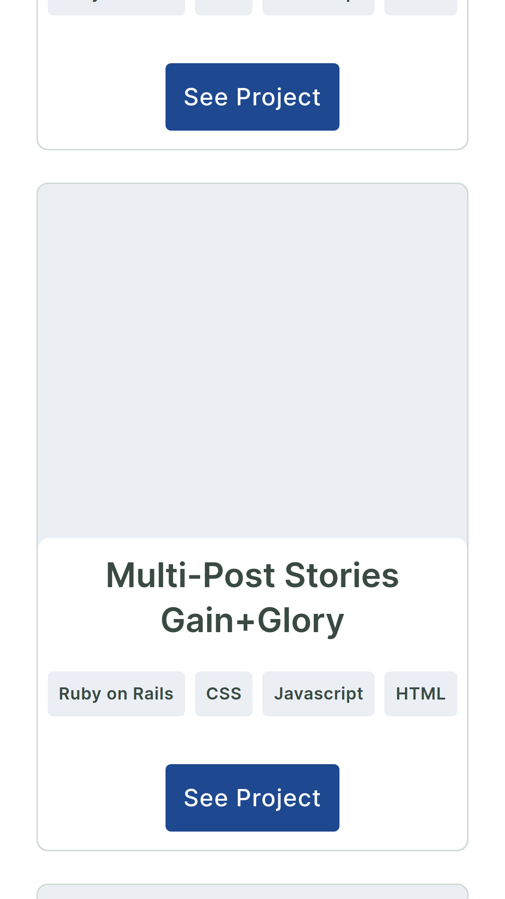
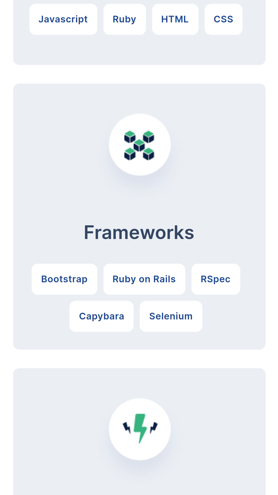
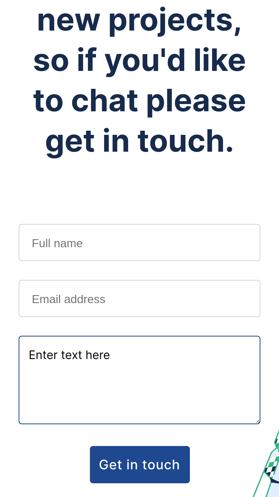

# Portfoilio mobile view

> The mobile view of the header section of my portfolio

Additional description about the project and its features.

## Deployed site
[Site link](https://kimutai01.github.io/portfolio-mobile-view/)

## Built With

- HTML
- CSS

## Live Demo
[Live demo link](https://kimutai01.github.io/portfolio-mobile-view/)

## Authors

👤 **Author1**

- GitHub: [@Kimutai01](https://github.com/Kimutai01)
- LinkedIn: [LinkedIn](https://www.linkedin.com/in/kimutai-kiprotich-1b5045216/)

## 🤝 Contributing

Contributions, issues, and feature requests are welcome!

Feel free to check the [issues page](../../issues/).

## Show your support

Give a ⭐️ if you like this project!

## Acknowledgments

- Hat tip to anyone whose code was used
- Inspiration
- etc

## 📝 License

This project is [MIT](./MIT.md) licensed.
